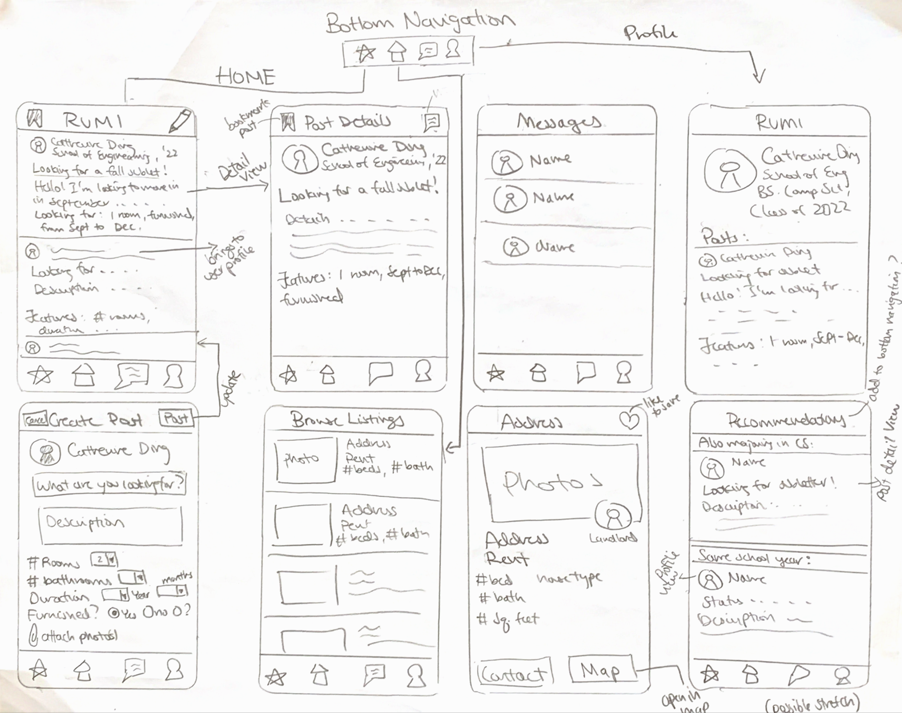

# Rumi/Homie 
(official name still tbd)

## Table of Contents
1. [Overview](#Overview)
1. [Product Spec](#Product-Spec)
1. [Weekly Plan](#Weekly-Plan)
1. [Wireframes](#Wireframes)
2. [Schema](#Schema)

## Overview
### Description
[Description of your app]

### App Evaluation
[Evaluation of your app across the following attributes]
- **Category:**
    - Real Estate
- **Mobile:** 
    - UI that easily navigates house search, roommate search, sublet search according to your interests. Easy in app messaging system. Easy camera access to take and attach photos to posts.
- **Story:** Tufts housing crisis is pretty real - only two years guaranteed housing which means a huge portion of upperclassmen look for or are forced to look for off campus housing, which also comes with its fair share of difficulties. These include:
    - Students who go home for the summer and need someone to stay at their place and sublet for those months since they signed a 12 month lease
    - Students want to stick with friends, but may not have the correct number of people for their desired residence
    - People coming to the campus community from outside for a temporary research or internship position need a place to stay

- **Market:**
    - Target user audience would be around college campuses where students often need to find off campus housing.
- **Habit:**
    - Students can easily message people they have similarities with to find housing and browse available houses near campus and see how far it is from various on campus locations. 
- **Scope:**
    - I believe a basic version of this app would be very doable by the end of this program. A stripped down version of just housing search and roommate matching would still be very interesting and various other features such as a financial tracker.

## Product Spec

### 1. User Stories (Required and Optional)

**Project Requirements**
* Your app has multiple views
* Your app interacts with a database (e.g. Parse) 
    * Parse or Firebase
* You can log in/log out of your app as a user
* You can sign up with a new user profile
    * New account stores information for name, major, year, profile picture
* Somewhere in your app you can use the camera to take a picture and do something with the picture (e.g. take a photo and share it to a feed, or take a photo and set a user’s profile picture)
    * You can take a pictures of your house to attach to your post
    * Take a profile photo
* Your app integrates with a SDK (e.g. Google Maps SDK, Facebook SDK)
    * Google Maps - view house locations
* Your app contains at least one more complex algorithm (talk over this with your manager)
    * TBD
* Your app uses gesture recognizers (e.g. double tap to like, e.g. pinch to scale)
    * For house search you can like other’s posts (double tap)
    * (possibly) Long press to save a post
* Your app use an animation (doesn’t have to be fancy) (e.g. fade in/out, e.g. animating a view growing and shrinking)
* Your app incorporates an external library to add visual polish
    * Material design for visual polish

**Required Must-have Stories**

- Use of Zillow API or other real estate API that displays house images, address, landlord contact info, number beds, number bathrooms, etc.
  - Integrate google maps sdk into this to view house addresses on a map
- Login/sign up page - can register new user with new info
- "Posts” section where you can compose a post about what you’re looking for
  - Ability to attach photos
  - Can message people by tapping on their profile photo
  - Ability to share post to outside sources - text, email, etc
  - Ability to take a picture for the post through the app
- Can compose a new post - check boxes or other UI features to help guide/log important info (#rooms, duration, etc)
- Profile tab that displays your information (name, status - what you're looking for, major, year, clubs/activities)
- Other users profile screen that also displays their info + ability to direct message them (a button)
- Chat screen that displays conversations + can navigate to each 1:1 conversation
- Advanced algo - would be super cool to figure out a recommendation algorithm that uses the info from each users profiles to recommend potential housemates

**Optional Nice-to-have Stories**

- Need some sort of referral code from someone already in the community to make an account
- A recommendations page where a complex algorithm is used to match and recommend people based on similar qualities
- Tab for your house once you found people
  - Shared payments, bills (utilities, furniture, etc)
  - Reminder system
  - Venmo housemates
  - Store important documents
  - Access landlord, utilities, etc contact info
- Different layout for parent accounts
- Sort through the posts by popularity or recent
- Sort through posts by customizable filter
- System where you can input common locations on campus and for each potential house it calculates an average walking distance score (averages of shortest paths to these place)
- Set a new profile picture (or take a picture)

- A way off idea (not sure if even remotely related) - a system similar to the investing app Acorns where for each of your payments it can auto round to the nearest whole dollar to invest, but instead of investing it, you can periodically put in money towards paying off your student loan
    - Pretty big issue for our generation rip + not sure how much this will actually help in the long run, but if you’re consistently able to put aside money starting from before you even graduate you could be ahead of the game

### 2. Screen Archetypes

- Home feed
  - Compose button (fragment) - options for looking for subletter, or sublet, duration, # rooms, female-identifying, male-identifying, etc.
  - Feed of posts
  - Ability to like posts (stretch - comment on posts, and save posts)
  - Go to user profiles by tapping on image - option to message them from profile pages
- General house rental browsing
  - Use of zillow api or other real estate api
  - Can like/favorite houses
  - View houses in map
- Profile (personal)
  - Display your status (ie. looking for ...)
  - Display major/minor, year, clubs/activities/interests
  - List of liked/saved posts
- Profile (other users)
  - Displays their status + other info
  - Ability to direct message them
  - (Stretch - add friend?)
  
- Other possible stretch screens
  - Ability to add users into your "house" to split bills
  - Track shared bills (utilities - heating, water, electricity, etc.) - add reminder system
  - Reminders to pay someone back for shared costs (furniture, other things?)
  - Store all pics of important documents for easy access

### 3. Navigation

**Tab Navigation** (Tab to Screen)

* Home feed (posts)
  * (sub/maybe not sub tab) Maybe a saved post/house section where you can see which houses you liked
* Profile section
* Real estate browsing section
* Messaging screen

**Flow Navigation** (Screen to Screen)

* Home feed
  * View posted addresses in google maps sdk
  * Compose a new post
  * Click on member profiles from profile picture
  * Go to saved
  * Contact poster - goes to messaging (in app or outside)
  * Share post to outside source (email, messages, etc)
* Profile - view name, major, year, clubs, etc.
  * Possible a friends section
  * List of liked posts
  * (stretch) place bills + housemates here - reminders
* Real estate browsing
  * View in google maps
  * Share to outside source - messages
  * Contact landlord/broker
* Messaging - list of ongoing conversations
  * Ability to delete a conversation
  * View user profile by tapping profile picture
  * Go into 1:1 conversation

## Weekly Plan (tentative)
### Week One
- Set up basic data models (user and posts) and validate they work
- Build the navigational skeleton (bottom navigation bar + fragments)
- Build out skeleton views
- Implement basic login/logout/signup feature
- Start working on the home timeline screen query and display data from Parse (or Firebase if I learn out to use it)
    - Make a details view for this
- Start working on the compose fragment to make a new post object
- Start fleshing out the profile fragment
- Add a comments activity (like from Parstagram) to the details view

### Week Two
- Finish up polishing home timeline
- Implement the liking feature if I haven't gotten to it already last week
- Implement the save post feature and screen where you can view all your saved posts
- Set up the messages screen with backend
- Start working on the real estate browsing screen that pulls data from an API

### Week Three
- Finish up anything I missed from last week
- Begin adding visual polish
- Begin adding an animation
- Begin adding a gesture recognizer

### Week Four
- Finish adding visual polish
- Finish adding an animation
- Finish adding a gesture recognizer
- Bring in an external library to make UI look better

## Wireframes

### [BONUS] Digital Wireframes & Mockups

### [BONUS] Interactive Prototype

## Schema 

### Models
#### Post
| Property | Type | Description |
| ------------- | ------------- | -------------|
| objectId  | String  | unique id for the user post (default field)|
| createdAt | DateTime | date when post is created (default field) |
| updatedAt | DateTime | date when post is last updated (default field) |
| author | Pointer to User | to get information on the User who posted|
| image | File | image that the user posts (optional) |
| title | String | the title status that will go above the body of the post |
| body | String | the text giving more details on the author's situation |
| numRooms | Number | number of rooms the author is looking for |
| duration | Number | the number of months the author is looking to stay/sublet |
| furnished | Boolean | if the author room their looking for/subletting is furnished (optional field) |
| rent | Number | rent required per month / maximum rent their |
| likes | Array of Pointers to Users | a list of users who has liked this post |

#### User
| Property | Type | Description |
| ------------- | ------------- | -------------|
| objectId  | String  | unique id for the user post (default field)|
| createdAt | DateTime | date when post is created (default field) |
| updatedAt | DateTime | date when post is last updated (default field) |
| name | String | the name of the user |
| password | String | user's password |
| email | String | user's email |
| profilePhoto | File | user's profile photo|
| major | String | user's major |
| year | Number | user's graduation year |
| hobbies | Array of Strings | user's hobbies |
| status | Boolean | true for looking for a place to stay false for looking for a subletter |
| savedPosts | Array of Pointers to Posts | when a user saves a post |

#### Comment
| Property | Type | Description |
| ------------- | ------------- | -------------|
| objectId  | String  | unique id for the user post (default field)|
| createdAt | DateTime | date when post is created (default field) |
| updatedAt | DateTime | date when post is last updated (default field) |
| postId | String | objectId of the post the comment is under |
| commentBody | String | the text inside the comment |
| user | Pointer to User | a pointer to the user who authored the comment|

#### Message
| Property | Type | Description |
| ------------- | ------------- | -------------|
| objectId  | String  | unique id for the user post (default field)|
| createdAt | DateTime | date when post is created (default field) |
| updatedAt | DateTime | date when post is last updated (default field) |
| messageAuthor | Pointer to User | who the message was written by |
| messageRecievedBy | Pointer to User | the user receiving the message | 

### Networking
#### List of network requests by screen
- Home feed of posts
    - (Read/GET) Query all posts (possible option to sort posts based on post fields which would mean specific queries)
    - (Create/POST) Create a new like on a post
    - (Create/COMMENT) Create a new comment on a post
    - (Update/USER) Save a post under the current user
    - (Update/USER) Unsave a post under the current user
    - (Delete) Delete existing post
    - (Delete) Delete existing comment
    - (Delete) Delete existing like
- Create post screen
    - (Create/POST) Create a new post object
- Profile section
    - (Read/GET) Query all posts made by current user / specific user
    - (Update/PUT) Update user profile image and other user components (name, major, year, etc.)
- Real estate browsing section
    - (Read/GET) Info on houses from the Zillow API
- Messaging screen (particular converation)
    - (Read/GET) Query all messages that were written by the current user and recieved by the other user and vice versa
    - (Create/POST) Create a new message object
- Saved posts screen
    - (Read/GET) Query all user's saved posts to display
    - (Update/USER) Unsave a post under the current user

#### Basic snippets for each Parse network request
TODO

#### Existing API Endpoints

##### RapidAPI (realtor)
- Base URL - (#https://realtor.p.rapidapi.com/)
| HTTP Verb | Endpoint | Description | Required Parameters | Optional Parameters |
| ------------- | ------------- | ------------- | ------------- | ------------- |
| GET | properties/v2/list-for-rent | lists properties for rent | city, state_code, limit, offset | beds_min, price_max, prop_type, sort, allows_cats, etc |
| GET | properties/v2/detail | get property detail information | property_id | N/A |

##### Zillow API
- Still need to find more info on this - it seems like Zillow might just be a good API for searching for specific properties rather than listing all available ones.
